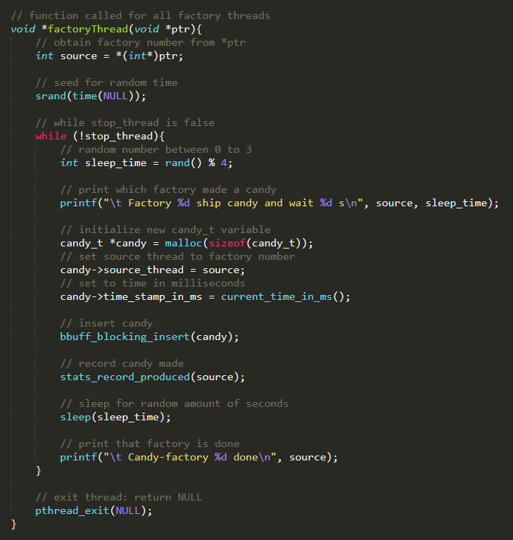

# ProducerConsumer-CandyFactory
Multithreaded Application  
1. Producer - factories that create candies to be consumed
2. Consumer - kids that consume candies created by factories 

Threads:
<ul>
  <li>FactoryThread: produces candy and calls method to insert it into the buffer 
    
</li>
  <li>KidThread: calls method that checks if candy is available and removes it from the buffer 
      
</li>
  </ul>
  
  Semaphores:
  <ul>
  <li>Empty: ensures the buffer has space for thread to insert a new candy</li>
  <li>Full: ensures the buffer has candy for thread to consume 
      

  </li>
  </ul>
  
Mutex: ensures only one thread accesses the shared buffer to prevent race conditions  
    

 
<b>Sample output:</b>  
    
